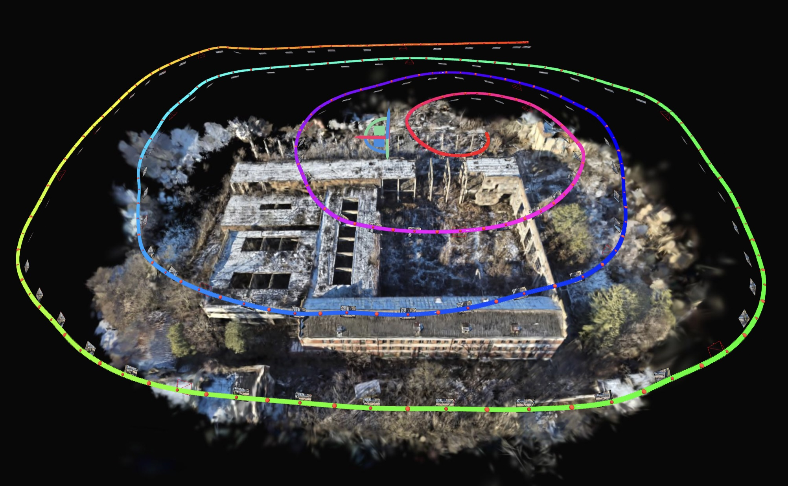

# ViPE Gaussian Splatting Pipeline



[▶ Watch the 3D reconstruction video on YouTube](https://youtu.be/ZgxRQRAwB9g?si=3wm0OdSNvdt5z208)

This project transforms an ordered sequence of aerial images into an interactive
3D Gaussian Splatting scene. Camera parameters and trajectory are recovered with
NVIDIA ViPE, while Nerfstudio Splatfacto is used for reconstruction,
visualization, and video rendering.

## Built With

- **NVIDIA ViPE** — camera pose and intrinsic estimation
- **COLMAP format** — camera, image, and point-cloud interchange
- **Nerfstudio Splatfacto** — 3D Gaussian Splatting training and rendering
- **PyTorch and CUDA** — GPU-accelerated inference and optimization
- **FFmpeg** — image-sequence preprocessing and video generation
- **Python, Bash, Make, and Conda** — automation and reproducible environments

Tested end-to-end on a local server running **Ubuntu 26.04** with an
**NVIDIA GeForce RTX 4050 Laptop GPU and 6 GB of VRAM**.

## Architecture

```text
Makefile commands
        ↓
Bash orchestration and environment management
        ↓
Python data processing and API adapters
        ↓
ViPE, FFmpeg, COLMAP format, and Nerfstudio
        ↓
Validated reconstruction and rendering artifacts
```

- **Makefile** provides the public command-line interface.
- **Bash scripts** manage environments, execute pipeline stages, and validate
  outputs.
- **Python scripts** process datasets and integrate with the ViPE and
  Nerfstudio APIs.
- **Configuration files** pin dependencies and define runtime and rendering
  settings.

## Makefile Interface

Run `make` or `make help` to list all available pipeline commands:

<details open>
<summary><strong>Available commands</strong></summary>

```text
Usage: make <command>
  help                     Show all available commands

Environment
  bootstrap                Install system packages and project-local Conda
  check                    Check host, GPU, tools, disk, and Conda prerequisites
  diagnose                 Diagnose both ViPE and Splatfacto environments
  setup                    Install both pinned ViPE and Splatfacto environments
  setup-vipe               Install the pinned ViPE environment
  diagnose-vipe            Validate the ViPE environment and CUDA runtime
  setup-splatfacto         Install the pinned Nerfstudio/Splatfacto environment
  diagnose-splatfacto      Validate the Nerfstudio/Splatfacto environment

Dataset
  inspect                  Validate and summarize input images without preparing videos
  prepare                  Validate images and prepare full and smoke MP4 inputs

Complete pipelines
  pipeline-smoke           Run ViPE, COLMAP export, and Splatfacto smoke stages
  pipeline-full            Run ViPE, COLMAP export, and Splatfacto full stages

ViPE and COLMAP
  vipe-smoke               Run ViPE on the smoke video
  vipe-full                Run ViPE on the complete video
  colmap-smoke             Export the smoke ViPE result to COLMAP format
  colmap-full              Export the complete ViPE result to COLMAP format

Splatfacto
  splat-smoke              Train the smoke Splatfacto model
  splat-full               Train the complete Splatfacto model
  resume-splat-smoke       Resume smoke training from its latest checkpoint
  resume-splat-full        Resume full training from its latest checkpoint
  validate-splat-smoke     Validate the completed smoke model and checkpoint
  validate-splat-full      Validate the completed full model and checkpoint

Viewer and rendering
  view-splat-smoke         Open the smoke model in the Nerfstudio Viewer
  view-splat-full          Open the full model with ordered camera keyframes
  render-splat-smoke       Render the newest smoke Viewer camera path
  render-splat-full        Render the newest full Viewer camera path
```

</details>

## Steps to Reproduce

<details>
<summary><strong>1. Clone the Repository</strong></summary>

On the remote machine:

```bash
git clone git@github.com:silkodenis/vipe-gaussian-splatting-pipeline-fv.git
cd vipe-gaussian-splatting-pipeline-fv
```

</details>

<details>
<summary><strong>2. Set Up the Environment</strong></summary>

On the remote machine, from the repository root:

```bash
make bootstrap  # Install system dependencies and project-local Conda
make check      # Validate the host system and NVIDIA GPU
make setup      # Install the pinned ViPE and Splatfacto environments
make diagnose   # Validate both GPU environments
```

</details>

<details>
<summary><strong>3. Upload the Dataset</strong></summary>

On the local machine containing the dataset:

*Update the paths and remote connection details below for your environment.*

```bash
LOCAL_ZIP="/path/to/dataset.zip"
REMOTE_USER="<user>"
REMOTE_HOST="<host-or-ip>"
REMOTE_REPO="/absolute/path/to/vipe-gaussian-splatting-pipeline-fv"
DATASET_NAME="<dataset-name>"

scp "${LOCAL_ZIP}" \
  "${REMOTE_USER}@${REMOTE_HOST}:/tmp/vipe-dataset.zip"

ssh "${REMOTE_USER}@${REMOTE_HOST}" \
  "mkdir -p '${REMOTE_REPO}/data/input/${DATASET_NAME}' && \
   unzip -j -n /tmp/vipe-dataset.zip '*.jpg' \
     -d '${REMOTE_REPO}/data/input/${DATASET_NAME}'"
```

</details>

<details>
<summary><strong>4. Inspect and Prepare the Dataset</strong></summary>

On the remote machine, from the repository root:

```bash
make inspect  # Validate the source images and dataset identity
make prepare  # Create the smoke and full ViPE input videos
```

The commands validate the source image sequence and create the smoke and full
ViPE input videos under `data/interim/`.

</details>

<details>
<summary><strong>5. Run the Full Reconstruction Pipeline</strong></summary>

On the remote machine, from the repository root:

```bash
make pipeline-full        # Run ViPE, COLMAP conversion, and Splatfacto training
make validate-splat-full  # Validate the trained model and final checkpoint
```

The commands produce and validate:

- ViPE camera poses and SLAM map
- COLMAP-compatible cameras, images, and point cloud
- trained Splatfacto model and final checkpoint

The generated artifacts are stored under:

- `artifacts/vipe/full/`
- `artifacts/colmap/full/<dataset-name>/`
- `artifacts/splatfacto/<dataset-name>/splatfacto/<run-timestamp>/`

</details>

<details>
<summary><strong>6. Review and Generate the Camera Path</strong></summary>

On the local machine, connect to the remote machine with Viewer port forwarding:

```bash
ssh -L 7007:localhost:7007 <user>@<host-or-ip>
```

In the remote SSH session, from the repository root:

```bash
make view-splat-full  # Open the trained model with the recovered camera path
```

Open [http://localhost:7007](http://localhost:7007), then:

1. Open the `RENDER` tab and review the preloaded camera path.
2. Adjust the keyframes or render settings if needed.
3. Click `Generate Command` to save the final camera-path JSON.
4. Do not copy or run the displayed `ns-render` command.
5. Stop the Viewer with `Ctrl+C`.

The generated camera path is stored under:

- `artifacts/colmap/full/<dataset-name>/camera_paths/<timestamp>.json`

</details>

<details>
<summary><strong>7. Render the Video</strong></summary>

On the remote machine, from the repository root:

```bash
make render-splat-full  # Render the newest generated camera path
```

The final video is stored under:

- `renders/<dataset-name>/<timestamp>.mp4`

</details>

## Pipeline Configuration

<details>
<summary><strong><code>configs/vipe.yaml</code></strong></summary>

Documents the verified ViPE dataset paths, low-VRAM pipeline profile, SLAM
settings, frame range, and output directories. It is a readable reference for
the current pipeline; runtime profile selection is controlled by `VIPE_PROFILE`
in `.env` and applied by `scripts/run_vipe.sh`.

</details>

<details>
<summary><strong><code>configs/splatfacto.yaml</code></strong></summary>

Records the verified Splatfacto dataset and training layout as a reference. Its
`render.dataset_path` section is consumed by `make view-splat-full` and defines
keyframe stride, transition duration, FPS, render resolution, Viewer
resolution, crop, and background color. Training memory overrides are
configured through `.env`.

</details>

<details>
<summary><strong><code>configs/versions.env</code></strong></summary>

Pins the ViPE source revision, Nerfstudio and PyTorch versions, CUDA build
target, tiny-cuda-nn revision, build concurrency, and Miniforge installer
checksum. Setup scripts load this file directly. Change it only when
intentionally upgrading and revalidating the dependency stack.

</details>

<details>
<summary><strong>Local overrides: <code>.env</code></strong></summary>

The default settings reproduce the verified reference result on the RTX 4050
machine; no local configuration file is required.

To customize the dataset, preprocessing, ViPE profile, or GPU memory settings:

```bash
cp .env.example .env
```

Edit `.env` for the local environment. The file is ignored by Git. Custom
datasets must use contiguous filenames ending in `_0001_v.jpg`, `_0002_v.jpg`,
and so on.

</details>
